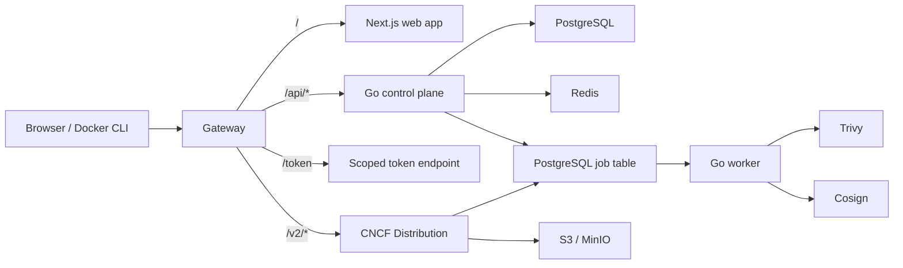

# HubCR

**English** | [简体中文](README.zh-CN.md)

**HubCR — Open-source OCI registry for teams and organizations.**

HubCR is a container image hub for individual developers and organizations. It
provides the business control plane around an OCI registry: identities, namespaces,
repositories, access control, metadata, and software supply-chain security. Mature
OCI upload and download behavior is delegated to CNCF Distribution instead of being
reimplemented.

> [!IMPORTANT]
> HubCR is in early development. The repository contains a runnable control plane,
> local-session, organization and repository APIs, a minimal authenticated web
> workspace, short-lived Registry token issuance, and a token-protected local
> Distribution gateway. Digest-keyed artifact, manifest/index, and current-tag
> persistence is connected to authenticated Distribution push events and exposed
> through policy-protected read APIs. Account bootstrap/invitation redemption,
> Registry operational metrics, web artifact workflows, and supply-chain security
> features are not implemented yet. Do not use the current version as a production
> registry.

## What HubCR is for

HubCR is designed to provide a Docker Hub-style experience while keeping the product
model and security policy under the project's control:

- personal and organization namespaces;
- public and private repositories;
- OCI image push, pull, tag, and deletion through CNCF Distribution;
- repository-scoped authorization for Docker and other OCI clients;
- organization membership and repository-level access control;
- artifact, manifest, tag, and digest metadata;
- asynchronous vulnerability scanning with Trivy;
- signature and attestation discovery and verification with Cosign;
- future robot accounts, access tokens, quotas, audit logs, webhooks, replication,
  proxy caching, and garbage collection.

Image names use a unified namespace model:

```text
hubcr.io/{namespace}/{repository}:{tag}
```

Examples:

```bash
docker pull hubcr.io/sunny/example:latest
docker push hubcr.io/my-organization/backend:v1.0.0
```

## Project status

| Area | Current status |
| --- | --- |
| Go control plane | Runnable service with PostgreSQL lifecycle, dependency-aware health, local sessions, organizations, repositories, Artifact/Tag read APIs, and centralized authorization |
| Asynchronous worker | Runnable polling scaffold; job persistence is not connected |
| Web application | Minimal authenticated Next.js workspace with typed, runtime-validated auth, organization/member, and repository flows |
| OCI data plane | Local gateway routes `/v2/` to token-protected CNCF Distribution backed by MinIO and `/token` to the Go control plane |
| PostgreSQL and Redis | Local Compose services defined; the control plane connects to PostgreSQL, while Redis is not connected |
| Users, organizations, and repositories | Identity/session APIs, personal namespaces, organization/member APIs, centralized capability policy, policy-protected repository APIs, and the corresponding minimal web workspace exist; account bootstrap/invitation redemption remains pending |
| Registry token service | Feature-gated RS256 token issuance with exact repository/action scopes, JWKS trust and rotation-ready verification |
| Artifact metadata | Authenticated Distribution push events reconcile repository-scoped immutable digests, manifest/index descriptors, and mutable current tags through GORM; authorized list/detail APIs are available |
| Trivy and Cosign | Worker boundaries reserved; integrations are pending |

## Architecture

HubCR separates the business control plane from the OCI data plane and keeps
long-running security work outside the request path.



### Component responsibilities

- **Next.js web application:** public pages, authenticated product UI, and typed API
  consumption.
- **Go control plane:** users, sessions, organizations, namespaces, repository
  metadata, authorization decisions, and REST APIs.
- **Registry token endpoint:** short-lived tokens containing an exact repository and
  action scope such as `pull`, `push`, or `delete`.
- **CNCF Distribution:** OCI `/v2/` protocol, manifests, blobs, uploads, downloads,
  and storage-driver integration.
- **Worker:** asynchronous scan, SBOM, signature, verification, and maintenance jobs.
- **PostgreSQL:** durable business records and the initial job queue.
- **Redis:** cache, rate-limit state, and short-lived coordination data.
- **S3 / MinIO:** OCI blob and manifest storage managed through Distribution.

See the [architecture document](docs/architecture.md) for repository boundaries and
module rules.

## Repository structure

```text
HubCR/
├── backend/
│   ├── AGENTS.md                Backend-only AI instructions
│   ├── cmd/api/                 Control-plane process
│   ├── cmd/worker/              Asynchronous worker process
│   ├── internal/app/            Application composition
│   ├── internal/modules/        Business capability boundaries
│   ├── internal/platform/       Configuration and infrastructure adapters
│   └── migrations/              PostgreSQL migrations
├── frontend/
│   ├── AGENTS.md                Frontend-only AI instructions
│   ├── app/                     Next.js routes and layouts
│   ├── features/                Product feature modules
│   ├── lib/api/                 Typed API client and Zod schemas
│   └── providers/               Application-wide client providers
├── deployments/compose/         Local development infrastructure
├── docs/                        Architecture and development documentation
├── AGENTS.md                    Primary repository-wide AI instructions
├── .env.example                 Local configuration template
└── Makefile                     Common development commands
```

## Technology stack

| Layer | Technology |
| --- | --- |
| Control plane and worker | Go 1.26, standard library HTTP server |
| Web application | Next.js 16, React 19, TypeScript |
| UI and client data | Tailwind CSS, TanStack Query, Zod |
| Primary database | PostgreSQL with GORM and the pgx-based GORM driver |
| Cache and coordination | Redis |
| OCI registry | CNCF Distribution |
| Object storage | S3-compatible storage; MinIO for local development |
| Vulnerability scanning | Trivy, planned asynchronous integration |
| Signatures and attestations | Cosign, planned asynchronous integration |
| Local orchestration | Docker Compose |
| Tests and validation | Go test, Go vet, Vitest, ESLint, TypeScript, Next.js build |

## Getting started

### Requirements

- Go 1.26 or newer;
- Bun 1.3 or newer;
- Docker with Compose support for the local infrastructure stack.

### 1. Clone and configure

```bash
git clone git@github.com:realqingtian/HubCR.git
cd HubCR
cp .env.example .env
```

The values in `.env.example` are development-only defaults. Never reuse them in a
shared or production environment.

### 2. Install web dependencies

```bash
cd frontend
bun install
cd ..
```

### 3. Start local infrastructure

```bash
make infra-up
```

This generates ignored local Registry signing material when needed, then starts
PostgreSQL, Redis, MinIO, CNCF Distribution, and the local gateway. See the [local
infrastructure guide](deployments/compose/README.md) for ports and details.

### 4. Start the applications

Run each process in a separate terminal:

```bash
make dev-api
```

```bash
make dev-worker
```

```bash
make dev-web
```

Default local endpoints:

| Service | URL |
| --- | --- |
| Web application | `http://localhost:3000` |
| Go control plane | `http://localhost:8080` |
| OCI gateway | `http://localhost:5000` |
| MinIO API | `http://localhost:9000` |
| MinIO console | `http://localhost:9001` |

### 5. Verify the control plane

```bash
curl --fail http://localhost:8080/api/v1/health/live
curl --fail http://localhost:8080/api/v1/health/ready
```

Liveness remains process-oriented. Readiness checks PostgreSQL and returns `200` only
while the database is reachable:

```json
{"status":"ok"}
```

When PostgreSQL is unavailable, readiness returns `503` with
`{"status":"unavailable"}` while liveness remains `200`.

Stop the local infrastructure with:

```bash
make infra-down
```

## Development commands

| Command | Purpose |
| --- | --- |
| `make dev-api` | Run the Go control plane |
| `make dev-worker` | Run the asynchronous worker |
| `make dev-web` | Run the Next.js development server |
| `make db-migrate` | Apply forward-only PostgreSQL migrations |
| `make registry-dev-keys` | Generate or validate ignored local Registry RSA/JWKS material |
| `make infra-config` | Validate the local Compose configuration |
| `make infra-up` | Start local infrastructure without changing named volumes |
| `make infra-down` | Stop local infrastructure without deleting named volumes |
| `make infra-status` | Show all local infrastructure container states |
| `make infra-smoke` | Check PostgreSQL, Redis, MinIO, and Distribution |
| `make test` | Run Go and frontend unit tests |
| `make test-integration` | Provision isolated PostgreSQL and run backend integration tests |
| `make test-m1-e2e` | Run M1 journeys 1–3 through real PostgreSQL, Go API, Next.js, and Chromium |
| `make test-m2-registry-e2e` | Run isolated real Docker push/pull and Registry authorization checks |
| `make check-docs` | Validate bilingual Markdown pairs, links, whitespace, and final newlines |
| `make check-secrets` | Scan tracked text for high-confidence credential patterns |
| `make check` | Run formatting checks, vet, tests, type checking, lint, and production build |

Run `make check` before requesting review or committing a completed change.

## Configuration

| Variable | Default | Purpose |
| --- | --- | --- |
| `HUBCR_API_ADDRESS` | `:8080` | Control-plane listen address |
| `HUBCR_SHUTDOWN_TIMEOUT` | `10s` | Graceful HTTP shutdown timeout |
| `HUBCR_DATABASE_URL` | local development PostgreSQL URL | Control-plane PostgreSQL connection URL |
| `HUBCR_DATABASE_CONNECT_TIMEOUT` | `5s` | Timeout for establishing a PostgreSQL connection |
| `HUBCR_DATABASE_HEALTH_TIMEOUT` | `2s` | Timeout for a readiness database check |
| `HUBCR_DATABASE_MAX_CONNECTIONS` | `10` | Maximum control-plane PostgreSQL pool size |
| `HUBCR_SESSION_TTL` | `24h` | Revocable web-session lifetime |
| `HUBCR_SESSION_COOKIE_SECURE` | `false` | Local HTTP cookie mode; set `true` for every HTTPS deployment |
| `HUBCR_REGISTRY_AUTH_ENABLED` | `false` | Enable `/token`; `make dev-api` enables it with isolated local signing material |
| `HUBCR_REGISTRY_EXTERNAL_URL` | none | Explicit external Registry origin; required when Registry auth is enabled |
| `HUBCR_REGISTRY_ALLOW_INSECURE_HTTP` | `false` | Allow an explicit HTTP Registry origin only for local development |
| `HUBCR_REGISTRY_SERVICE` | `hubcr-registry` | Distribution challenge Service and JWT Audience |
| `HUBCR_REGISTRY_ISSUER` | `hubcr-token-service` | JWT Issuer shared with Distribution |
| `HUBCR_REGISTRY_TOKEN_TTL` | `5m` | Short-lived Registry Token TTL; accepted range is `1m`–`15m` |
| `HUBCR_REGISTRY_TOKEN_PRIVATE_KEY_FILE` | none | Absolute read-only path to the active RSA private key |
| `HUBCR_REGISTRY_TOKEN_JWKS_FILE` | none | Absolute path to the trusted public JWKS containing the active and optional retiring keys |
| `HUBCR_WORKER_POLL_INTERVAL` | `5s` | Worker polling interval |
| `HUBCR_CONTROL_PLANE_URL` | `http://127.0.0.1:8080` | Server-side target for the Next.js same-origin `/api` rewrite |
| `NEXT_PUBLIC_API_BASE_URL` | same origin | Optional browser-visible override for a CORS-enabled endpoint |
| `POSTGRES_DB` | `hubcr` | Local PostgreSQL database |
| `POSTGRES_USER` | `hubcr` | Local PostgreSQL user |
| `POSTGRES_PASSWORD` | development only | Local PostgreSQL password |
| `MINIO_ROOT_USER` | `hubcr` | Local MinIO administrator |
| `MINIO_ROOT_PASSWORD` | development only | Local MinIO password |
| `HUBCR_REGISTRY_PORT` | `5000` | Local host port published for the OCI gateway |
| `HUBCR_POSTGRES_PORT` | `5432` | Local PostgreSQL host port |
| `HUBCR_REDIS_PORT` | `6379` | Local Redis host port |
| `HUBCR_MINIO_PORT` | `9000` | Local MinIO API host port |
| `HUBCR_MINIO_CONSOLE_PORT` | `9001` | Local MinIO console host port |

## Core security and data rules

- Repository access is authorized for every request, even when blobs are physically
  deduplicated by digest.
- Web sessions are not long-lived Registry credentials.
- Registry tokens must be short-lived and limited to an exact repository and action
  scope.
- Scan reports, SBOMs, and signature verification results are bound to immutable
  artifact digests, never only to mutable tags.
- Finding a signature is not the same as trusting it. Trust depends on successful
  verification against a versioned policy.
- Scanning and verification are asynchronous and must not block a successful image
  push unless an explicit repository policy requires it.
- Secrets and real credentials must never be committed. The repository only contains
  clearly marked local development defaults.

## Documentation

English is the primary documentation language. Every user-facing project document
must link to and remain synchronized with its Simplified Chinese counterpart.

| Document | English | 简体中文 |
| --- | --- | --- |
| Project overview | [README](README.md) | [README](README.zh-CN.md) |
| Product requirements | [Requirements](docs/requirements.md) | [产品需求](docs/requirements.zh-CN.md) |
| Executable development plan | [Development plan](docs/development-plan.md) | [开发计划](docs/development-plan.zh-CN.md) |
| Architecture | [Architecture](docs/architecture.md) | [架构](docs/architecture.zh-CN.md) |
| Development standards | [Development](docs/development.md) | [开发规范](docs/development.zh-CN.md) |
| Control-plane API contract | [API](docs/api.md) | [API](docs/api.zh-CN.md) |
| Registry authentication protocol | [Registry auth](docs/registry-authentication.md) | [Registry 认证](docs/registry-authentication.zh-CN.md) |
| Artifact metadata persistence | [Artifact persistence](docs/artifact-metadata-persistence.md) | [Artifact 持久化](docs/artifact-metadata-persistence.zh-CN.md) |
| Distribution event reconciliation | [Event reconciliation](docs/distribution-event-reconciliation.md) | [事件协调](docs/distribution-event-reconciliation.zh-CN.md) |
| AI instruction hierarchy | [Instructions](AGENTS.md) | [AI 指令](AGENTS.zh-CN.md) |
| Local infrastructure | [Compose](deployments/compose/README.md) | [本地基础设施](deployments/compose/README.zh-CN.md) |
| Web application | [Web](frontend/README.md) | [Web 应用](frontend/README.zh-CN.md) |

## Roadmap

1. **Registry MVP:** users, sessions, namespaces, organizations, repositories,
   visibility, scoped tokens, push/pull, tags, and artifact metadata.
2. **Supply-chain security:** Trivy scans, SBOMs, Cosign discovery and verification,
   trust policies, and security status pages.
3. **Operations:** robot accounts, access tokens, quotas, audit logs, webhooks,
   deletion, garbage collection, replication, and proxy caching.
4. **Public service readiness:** email verification, password recovery, MFA, abuse
   controls, billing, high availability, and multi-region delivery.

## Contributing

Read the [development standards](docs/development.md), the primary
[AI instructions](AGENTS.md), and the nearest directory-specific `AGENTS.md` before
making changes. Keep changes scoped, include tests for behavior, update both
documentation languages, and run `make check` before submitting work.

## License status

HubCR is intended to be an open-source project, but a license file has not been added
yet. A license must be selected before the first public release.
