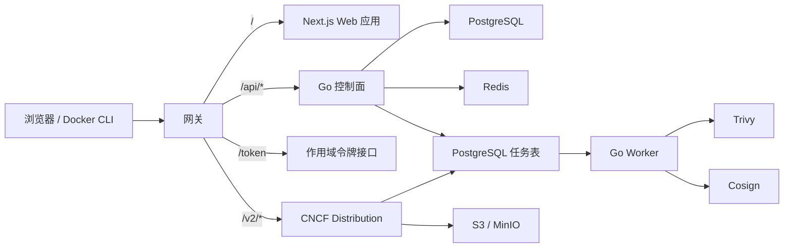

# HubCR

[English](README.md) | **简体中文**

**HubCR — 面向团队与组织的开源 OCI 镜像中心。**

HubCR 是面向个人开发者与组织的容器镜像中心。它围绕 OCI Registry 提供业务
控制面，包括身份、命名空间、仓库、访问控制、元数据和软件供应链安全能力。
成熟的 OCI 上传与下载行为交给 CNCF Distribution 处理，而不是从零重复实现。

> [!IMPORTANT]
> HubCR 目前处于早期开发阶段。仓库中已经包含可运行的控制面、本地 Session、组织和
> Repository API、最小登录态 Web 工作区、短期 Registry Token 签发，以及受 Token
> 保护的本地 Distribution Gateway。以 Digest 为键的 Artifact、Manifest/Index 和当前
> Tag 持久化已接入经过认证的 Distribution Push Event，并通过受 Policy 保护的读取 API
> 暴露。本地运维已具备 Registry Challenge、Token 决策、通知和协调遥测。账号
> Bootstrap/邀请兑换、Web Artifact 工作流和软件供应链安全能力尚未实现。当前版本不能
> 作为生产环境镜像仓库使用。

## HubCR 的用途

HubCR 旨在提供类似 Docker Hub 的使用体验，同时让项目能够自主控制产品模型和
安全策略：

- 个人与组织命名空间；
- 公开与私有仓库；
- 通过 CNCF Distribution 完成 OCI 镜像 Push、Pull、Tag 和删除；
- 面向 Docker 及其他 OCI 客户端的仓库级授权；
- 组织成员与仓库级访问控制；
- Artifact、Manifest、Tag 与 Digest 元数据；
- 使用 Trivy 异步执行漏洞扫描；
- 使用 Cosign 发现并验证签名与证明材料；
- 后续扩展 Robot Account、访问令牌、配额、审计日志、Webhook、镜像复制、
  代理缓存和垃圾回收。

镜像名称采用统一命名空间模型：

```text
hubcr.io/{namespace}/{repository}:{tag}
```

示例：

```bash
docker pull hubcr.io/sunny/example:latest
docker push hubcr.io/my-organization/backend:v1.0.0
```

## 项目状态

| 范围 | 当前状态 |
| --- | --- |
| Go 控制面 | 已有可运行服务、PostgreSQL 生命周期、依赖感知健康检查、本地 Session、组织、Repository、Artifact/Tag 读取 API 和集中授权 |
| 异步 Worker | 已有可运行的轮询骨架，尚未连接任务持久化 |
| Web 应用 | 已有登录态 Next.js Shell、Overview、Namespace 与 Repository Detail 路由，以及经过运行时校验的类型化认证、组织/成员和 Repository 管理流程；Artifact/Tag Web 发现仍待实现 |
| OCI 数据面 | 本地 Gateway 将 `/v2/` 路由到 MinIO 支持且受 Token 保护的 CNCF Distribution，并将 `/token` 路由到 Go 控制面 |
| PostgreSQL 与 Redis | 已定义本地 Compose 服务；控制面已连接 PostgreSQL，Redis 尚未接入 |
| 用户、组织与仓库 | 已有身份/Session API、个人 Namespace、组织/成员 API、集中能力 Policy、受 Policy 保护的 Repository API 及对应最小 Web 工作区；账号 Bootstrap/邀请兑换仍待实现 |
| Registry Token 服务 | 已实现功能开关控制的 RS256 Token 签发、精确 Repository/Action Scope、JWKS 信任及支持轮换的验证 |
| Artifact 元数据 | 已通过经过认证的 Distribution Push 事件与 GORM 协调 Repository 级不可变 Digest、Manifest/Index Descriptor 和可变当前 Tag，并提供经过授权的列表/详情 API |
| Registry 可观测性 | 已有不泄露 Secret 的 Challenge/Token/通知结构化日志、有界控制面 Counter 及仅监听 localhost 的 Distribution 指标/队列可见性 |
| Trivy 与 Cosign | 已预留 Worker 边界，集成尚未实现 |

## 架构

HubCR 将业务控制面与 OCI 数据面分离，并把耗时的安全任务移出请求主链路。



### 组件职责

- **Next.js Web 应用：**公开页面、登录后的产品界面和类型化 API 调用。
- **Go 控制面：**用户、会话、组织、命名空间、仓库元数据、授权决策与 REST API。
- **Registry Token 接口：**签发短期令牌，并包含精确的仓库及 `pull`、`push`、
  `delete` 等操作范围。
- **CNCF Distribution：**负责 OCI `/v2/` 协议、Manifest、Blob、上传、下载及
  存储驱动集成。
- **Worker：**异步执行扫描、SBOM、签名、验签和维护任务。
- **PostgreSQL：**持久化业务记录，并在早期阶段承担任务队列。
- **Redis：**缓存、限流状态与短期协调数据。
- **S3 / MinIO：**由 Distribution 管理的 OCI Blob 与 Manifest 存储。

仓库边界与模块规则详见[架构文档](docs/architecture.zh-CN.md)。

## 仓库结构

```text
HubCR/
├── backend/
│   ├── AGENTS.md                仅作用于后端的 AI 指令
│   ├── cmd/api/                 控制面进程
│   ├── cmd/worker/              异步 Worker 进程
│   ├── internal/app/            应用组合
│   ├── internal/modules/        业务能力边界
│   ├── internal/platform/       配置与基础设施适配器
│   └── migrations/              PostgreSQL 数据库迁移
├── frontend/
│   ├── AGENTS.md                仅作用于前端的 AI 指令
│   ├── app/                     Next.js 路由与布局
│   ├── features/                产品功能模块
│   ├── lib/api/                 类型化 API 客户端与 Zod Schema
│   └── providers/               应用级客户端 Provider
├── deployments/compose/         本地开发基础设施
├── docs/                        架构与开发文档
├── AGENTS.md                    仓库级主要 AI 指令入口
├── .env.example                 本地配置模板
└── Makefile                     常用开发命令
```

## 技术栈

| 分层 | 技术 |
| --- | --- |
| 控制面与 Worker | Go 1.26、标准库 HTTP Server |
| Web 应用 | Next.js 16、React 19、TypeScript |
| UI 与客户端数据 | Tailwind CSS、TanStack Query、Zod |
| 主数据库 | PostgreSQL、GORM 及基于 pgx 的 GORM Driver |
| 缓存与协调 | Redis |
| OCI Registry | CNCF Distribution |
| 对象存储 | S3 兼容存储；本地开发使用 MinIO |
| 漏洞扫描 | Trivy，规划为异步集成 |
| 签名与证明材料 | Cosign，规划为异步集成 |
| 本地编排 | Docker Compose |
| 测试与验证 | Go test、Go vet、Vitest、ESLint、TypeScript、Next.js Build |

## 快速开始

### 环境要求

- Go 1.26 或更高版本；
- Bun 1.3 或更高版本；
- 用于启动本地基础设施的 Docker 与 Compose。

### 1. 克隆并配置项目

```bash
git clone git@github.com:realqingtian/HubCR.git
cd HubCR
cp .env.example .env
```

`.env.example` 中的值仅供本地开发使用，不能在共享环境或生产环境中复用。

### 2. 安装 Web 依赖

```bash
cd frontend
bun install
cd ..
```

### 3. 启动本地基础设施

```bash
make infra-up
```

该命令会在需要时生成被忽略的本地 Registry 签名材料，然后启动 PostgreSQL、Redis、
MinIO、CNCF Distribution 和本地 Gateway。端口及详细说明参见
[本地基础设施文档](deployments/compose/README.zh-CN.md)。

### 4. 启动应用

在不同终端中分别运行：

```bash
make dev-api
```

```bash
make dev-worker
```

```bash
make dev-web
```

默认本地地址：

| 服务 | 地址 |
| --- | --- |
| Web 应用 | `http://localhost:3000` |
| Go 控制面 | `http://localhost:8080` |
| OCI Gateway | `http://localhost:5000` |
| MinIO API | `http://localhost:9000` |
| MinIO 控制台 | `http://localhost:9001` |

### 5. 验证控制面

```bash
curl --fail http://localhost:8080/api/v1/health/live
curl --fail http://localhost:8080/api/v1/health/ready
```

存活检查只反映进程状态；就绪检查会检查 PostgreSQL，数据库可访问时才返回 `200`：

```json
{"status":"ok"}
```

PostgreSQL 不可用时，就绪检查返回 `503` 与 `{"status":"unavailable"}`，存活检查
仍保持 `200`。

停止本地基础设施：

```bash
make infra-down
```

## 开发命令

| 命令 | 作用 |
| --- | --- |
| `make dev-api` | 运行 Go 控制面 |
| `make dev-worker` | 运行异步 Worker |
| `make dev-web` | 运行 Next.js 开发服务器 |
| `make db-migrate` | 应用仅向前的 PostgreSQL 迁移 |
| `make registry-dev-keys` | 生成或验证被忽略的本地 Registry RSA/JWKS 材料 |
| `make infra-config` | 验证本地 Compose 配置 |
| `make infra-up` | 启动本地基础设施且不改变命名卷 |
| `make infra-down` | 停止本地基础设施且不删除命名卷 |
| `make infra-status` | 显示全部本地基础设施容器状态 |
| `make infra-smoke` | 检查 PostgreSQL、Redis、MinIO 和 Distribution |
| `make test` | 运行 Go 与前端单元测试 |
| `make test-integration` | 提供隔离 PostgreSQL 并运行后端集成测试 |
| `make test-m1-e2e` | 通过真实 PostgreSQL、Go API、Next.js 与 Chromium 运行 M1 流程 1–3 |
| `make test-m2-registry-e2e` | 运行隔离的真实 Docker Push/Pull 与 Registry 授权检查 |
| `make check-docs` | 验证双语 Markdown 配对、链接、空白与文件末尾换行 |
| `make check-secrets` | 扫描已跟踪文本中的高置信度凭据模式 |
| `make check` | 运行格式检查、Vet、测试、类型检查、Lint 和生产构建 |

请求代码审查或提交完整改动之前必须运行 `make check`。

## 配置

| 变量 | 默认值 | 作用 |
| --- | --- | --- |
| `HUBCR_API_ADDRESS` | `:8080` | 控制面监听地址 |
| `HUBCR_SHUTDOWN_TIMEOUT` | `10s` | HTTP 优雅退出超时 |
| `HUBCR_DATABASE_URL` | 本地开发 PostgreSQL URL | 控制面 PostgreSQL 连接 URL |
| `HUBCR_DATABASE_CONNECT_TIMEOUT` | `5s` | 建立 PostgreSQL 连接的超时时间 |
| `HUBCR_DATABASE_HEALTH_TIMEOUT` | `2s` | 就绪数据库检查的超时时间 |
| `HUBCR_DATABASE_MAX_CONNECTIONS` | `10` | 控制面 PostgreSQL 连接池上限 |
| `HUBCR_SESSION_TTL` | `24h` | 可撤销 Web Session 的有效期 |
| `HUBCR_SESSION_COOKIE_SECURE` | `false` | 本地 HTTP Cookie 模式；所有 HTTPS 部署必须设为 `true` |
| `HUBCR_REGISTRY_AUTH_ENABLED` | `false` | 启用 `/token`；`make dev-api` 会使用隔离的本地签名材料将其启用 |
| `HUBCR_REGISTRY_EXTERNAL_URL` | 无 | 显式外部 Registry Origin；启用 Registry Auth 时必填 |
| `HUBCR_REGISTRY_ALLOW_INSECURE_HTTP` | `false` | 仅为本地开发显式允许 HTTP Registry Origin |
| `HUBCR_REGISTRY_SERVICE` | `hubcr-registry` | Distribution Challenge Service 与 JWT Audience |
| `HUBCR_REGISTRY_ISSUER` | `hubcr-token-service` | 与 Distribution 共享的 JWT Issuer |
| `HUBCR_REGISTRY_TOKEN_TTL` | `5m` | Registry 短期 Token TTL；允许范围为 `1m`–`15m` |
| `HUBCR_REGISTRY_TOKEN_PRIVATE_KEY_FILE` | 无 | 活动 RSA 私钥的只读绝对路径 |
| `HUBCR_REGISTRY_TOKEN_JWKS_FILE` | 无 | 包含活动公钥与可选退出公钥的可信公开 JWKS 绝对路径 |
| `HUBCR_WORKER_POLL_INTERVAL` | `5s` | Worker 轮询间隔 |
| `HUBCR_CONTROL_PLANE_URL` | `http://127.0.0.1:8080` | Next.js 同源 `/api` Rewrite 的服务端目标 |
| `NEXT_PUBLIC_API_BASE_URL` | 同源 | 面向已启用 CORS 端点的可选浏览器公开覆盖项 |
| `POSTGRES_DB` | `hubcr` | 本地 PostgreSQL 数据库 |
| `POSTGRES_USER` | `hubcr` | 本地 PostgreSQL 用户 |
| `POSTGRES_PASSWORD` | 仅供开发 | 本地 PostgreSQL 密码 |
| `MINIO_ROOT_USER` | `hubcr` | 本地 MinIO 管理员 |
| `MINIO_ROOT_PASSWORD` | 仅供开发 | 本地 MinIO 密码 |
| `HUBCR_REGISTRY_PORT` | `5000` | OCI Gateway 发布到本机的端口 |
| `HUBCR_REGISTRY_DEBUG_PORT` | `5002` | 仅监听 Loopback 的 Distribution Debug/Prometheus 宿主端口 |
| `HUBCR_POSTGRES_PORT` | `5432` | 本地 PostgreSQL 宿主端口 |
| `HUBCR_REDIS_PORT` | `6379` | 本地 Redis 宿主端口 |
| `HUBCR_MINIO_PORT` | `9000` | 本地 MinIO API 宿主端口 |
| `HUBCR_MINIO_CONSOLE_PORT` | `9001` | 本地 MinIO 控制台宿主端口 |

## 核心安全与数据规则

- 即使 Blob 按 Digest 在物理层去重，每次请求仍必须按照仓库执行授权判断。
- Web 会话不能直接作为长期 Registry 凭据。
- Registry Token 必须是短期令牌，并限制到精确的仓库与操作范围。
- 扫描报告、SBOM 和签名验证结果必须绑定不可变的 Artifact Digest，不能只绑定
  可变的 Tag。
- 发现签名不等于签名可信；可信状态必须来自针对版本化策略的成功验证。
- 扫描和验签必须异步执行，除非仓库明确启用阻断策略，否则不能阻塞成功的镜像
  Push。
- 禁止提交密钥和真实凭据；仓库只能包含明确标注的本地开发默认值。

## 文档

英文是项目的主文档语言。每份面向用户的项目文档都必须链接到简体中文版，并在
修改时保持两个版本同步。

| 文档 | English | 简体中文 |
| --- | --- | --- |
| 项目介绍 | [README](README.md) | [README](README.zh-CN.md) |
| 产品需求 | [Requirements](docs/requirements.md) | [产品需求](docs/requirements.zh-CN.md) |
| 可执行开发计划 | [Development plan](docs/development-plan.md) | [开发计划](docs/development-plan.zh-CN.md) |
| 架构 | [Architecture](docs/architecture.md) | [架构](docs/architecture.zh-CN.md) |
| 开发规范 | [Development](docs/development.md) | [开发规范](docs/development.zh-CN.md) |
| 控制面 API 契约 | [API](docs/api.md) | [API](docs/api.zh-CN.md) |
| Registry 认证协议 | [Registry auth](docs/registry-authentication.md) | [Registry 认证](docs/registry-authentication.zh-CN.md) |
| Artifact 元数据持久化 | [Artifact persistence](docs/artifact-metadata-persistence.md) | [Artifact 持久化](docs/artifact-metadata-persistence.zh-CN.md) |
| Distribution 事件协调 | [Event reconciliation](docs/distribution-event-reconciliation.md) | [事件协调](docs/distribution-event-reconciliation.zh-CN.md) |
| Registry 运维可观测性 | [Registry observability](docs/registry-observability.md) | [Registry 可观测性](docs/registry-observability.zh-CN.md) |
| AI 指令层级 | [Instructions](AGENTS.md) | [AI 指令](AGENTS.zh-CN.md) |
| 本地基础设施 | [Compose](deployments/compose/README.md) | [本地基础设施](deployments/compose/README.zh-CN.md) |
| Web 应用 | [Web](frontend/README.md) | [Web 应用](frontend/README.zh-CN.md) |

## 路线图

1. **Registry MVP：**用户、会话、命名空间、组织、仓库、可见性、作用域令牌、
   Push/Pull、Tag 与 Artifact 元数据。
2. **供应链安全：**Trivy 扫描、SBOM、Cosign 签名发现与验证、信任策略和安全
   状态页面。
3. **运营能力：**Robot Account、访问令牌、配额、审计日志、Webhook、删除、
   垃圾回收、复制与代理缓存。
4. **公网服务准备：**邮箱验证、密码找回、MFA、滥用防护、计费、高可用与多区域
   分发。

## 参与开发

修改项目前请阅读[开发规范](docs/development.zh-CN.md)、主要
[AI 指令](AGENTS.zh-CN.md)以及离目标文件最近的目录专属 `AGENTS.md`。改动应
保持聚焦，为行为变化补充测试，同步更新中英文文档，并在提交前运行
`make check`。

## 许可证状态

HubCR 计划作为开源项目发布，但目前尚未添加许可证文件。第一次公开发布前必须
确定并添加许可证。
