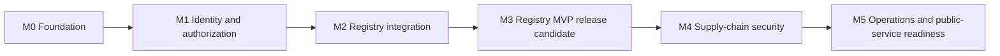

# HubCR executable development plan

**English** | [简体中文](development-plan.zh-CN.md)

- Status: active living plan
- Plan start: 2026-08-01
- Current stage: Milestones 0–2 and M3-01 through M3-06 are done; M3-07 is blocked on the G-04 deployment and backup subset
- Requirements: [HubCR product requirements](requirements.md)

This plan converts the product baseline into ordered, testable work. It is a delivery
control document: update task state and evidence here when work is completed, split
implementation details into issues when useful, and do not mark a capability complete
until its acceptance evidence exists.

## 1. How to use this plan

### Status labels

- `DONE`: implemented and acceptance evidence recorded.
- `IN PROGRESS`: currently being implemented; one owner is responsible for the next
  update.
- `READY`: requirements and dependencies are sufficient to start.
- `BLOCKED`: a named decision or dependency prevents correct implementation.
- `PLANNED`: sequenced but not yet ready.

### Rules for maintaining the plan

1. Every task has an ID, result, dependencies, acceptance checks, and evidence.
2. A task moves to `READY` only when its decision gates and upstream dependencies are
   complete.
3. A task moves to `DONE` only after its checks pass; code presence alone is not
   completion.
4. If implementation changes product behavior, update the English and Simplified
   Chinese requirements and plan in the same change.
5. Record evidence as commands, test names, links to decision records, or commit IDs.
6. Review the active milestone weekly or after every three completed tasks, whichever
   occurs first.
7. At milestone exit, update the README status table and re-plan the next milestone
   from current evidence.

Effort ranges below are rough focused-engineering estimates for one contributor using
AI assistance. They are planning aids, not delivery promises, and exclude waiting for
product decisions, external reviews, or environment downloads.

## 2. Verified starting point

| Baseline | State on 2026-08-01 | Evidence |
| --- | --- | --- |
| Repository | `main` tracks `origin/main`; scaffold and bilingual documentation exist | Git inspection |
| Go control plane | Liveness/readiness endpoints, configuration, HTTP server and graceful shutdown exist | Unit tests and prior runtime smoke |
| Worker | Polling and graceful shutdown scaffold exists | Code and repository checks |
| Web | Authenticated overview, Namespace, Repository, Artifact/Tag lists, and immutable Digest Detail routes use TanStack Query and Zod-validated API contracts | Unit tests, production build, mocked state journeys and real Push-to-Web browser evidence |
| Docker host | Docker Engine `29.6.2`, Compose `v5.3.1`, `linux/arm64` server | `docker --version`, `docker compose version`, `docker info` |
| Compose definition | PostgreSQL 17, Redis 7, MinIO and Distribution 3 configuration parses successfully | `docker compose ... config --quiet` |
| Compose runtime | Full stack smoke passes on Apple Silicon; the Registry host port can be overridden when macOS reserves `5000` | [Compose smoke evidence](../deployments/compose/README.md#verified-environment) |
| Application integration | API owns a PostgreSQL pool and dependency-aware readiness; worker and Redis connections remain pending | Unit, live dependency-loss/recovery, and graceful-shutdown checks |
| Registry integration | Scoped token issuance, the token-protected local gateway, push-event reconciliation, authorized Artifact/Tag read APIs, and operational telemetry are complete | Go/PostgreSQL integration and Docker/OCI/API/telemetry acceptance tests |

The project has completed Milestones 0 through 2 and M3-01 through M3-06. The
authenticated Web experience now covers navigation, policy-derived Quick-start,
Artifact discovery, deterministic plus real-browser acceptance, and source-backed
security remediation. M3-07 cannot start until the named G-04 subset is approved.

## 3. Decision gates

These gates come from the [requirements decision register](requirements.md#10-open-decision-register).
The project owner approves product decisions; implementation work records them under
`docs/decisions/` in both languages.

| Gate | Decisions | Blocks | Current state |
| --- | --- | --- | --- |
| G-01 Product entry | D-001 product mode, D-002 registration, D-003 initial identity | Session schema, login and registration UI | `CLOSED` on 2026-08-01; [accepted records](decisions/README.md#m0-decision-session) |
| G-02 Authorization | D-004 organization roles, D-005 grant inheritance, D-006 public pull | Membership schema, authorization service, Registry tokens | `CLOSED` on 2026-08-01; [accepted records](decisions/README.md#m0-decision-session) |
| G-03 Security policy | D-007 pull enforcement, D-008 signature trust | Scan policy and signature-verification contracts | `PLANNED` before Milestone 4 |
| G-04 Operations | D-009 production target, D-010 operating policy | Production deployment, deletion, retention, GC and backups | `BLOCKED` for M3-07 until the supported MVP deployment and backup subset is approved |
| G-05 Open source | D-011 license | First public release | `BLOCKED` before public release |

Decision records must state context, chosen option, rejected alternatives,
consequences, and the date. G-01 and G-02 are closed; later gates still constrain their
respective milestones.

## 4. Milestone map

| Milestone | Outcome | Approximate focused effort | Entry gate |
| --- | --- | --- | --- |
| M0 | Reproducible infrastructure, persistence and API foundations | 1–2 weeks | Current scaffold |
| M1 | Users, sessions, namespaces, organizations, repositories and policy checks | 4–6 weeks | G-01 and G-02 |
| M2 | Authorized OCI push/pull and digest-based metadata reconciliation | 3–5 weeks | M1 |
| M3 | Truthful web workflows and automated Registry MVP acceptance | 2–4 weeks | M2 |
| M4 | Async Trivy, SBOM, Cosign and trust-state workflows | 4–7 weeks | G-03 and M3 |
| M5 | Robot access, audit, quotas, lifecycle and deployability | Incremental | G-04 and M4 |

The M1 estimate was recalculated after G-01 and G-02 closed. Administrator invitations,
local password credentials, revocable sessions, and a four-role authorization matrix
increase the original lower bound. M2 remains 3–5 weeks because D-006 preserves one
fixed public-pull mode instead of adding deployment-configurable variants.

## 5. Milestone 0 — integration foundation

Goal: turn the scaffold into a reproducible development base without prematurely
encoding open product policy.

### M0 work packages

| ID | State | Result | Dependencies | Effort |
| --- | --- | --- | --- | --- |
| M0-01 | `DONE` | Requirements baseline and executable bilingual plan reflect current repository truth | None | 1–2 days |
| M0-02 | `DONE` | Compose stack starts on Apple Silicon and services pass documented smoke checks | Docker Desktop | 0.5–1 day |
| M0-03 | `DONE` | Repeatable `infra-up`, `infra-down`, `infra-status`, and infrastructure smoke commands | M0-02 | 0.5 day |
| M0-04 | `DONE` | PostgreSQL connection lifecycle, configuration validation and dependency-aware readiness | M0-02 | 1–2 days |
| M0-05 | `DONE` | Migration tool and initial schema conventions with forward and clean-database tests | M0-04 | 1–2 days |
| M0-06 | `DONE` | Shared API response/error, request ID, JSON and pagination conventions | None | 1–2 days |
| M0-07 | `DONE` | CI workflow and hosted `make check` plus isolated PostgreSQL run pass on the authorized feature-branch push | M0-01 | 1–2 days |
| M0-08 | `DONE` | G-01 and G-02 decision records approved in both languages on 2026-08-01 | Product owner | 0.5–1 day decision session |
| M0-09 | `DONE` | Integration-test harness provisions isolated PostgreSQL and exercises migrations | M0-04, M0-05 | 1–2 days |

### M0 acceptance checks

**M0-02 local infrastructure**

These checks record the M0 exit configuration before M2 introduced mandatory token
authentication; the current workflow and response are documented in the Compose
guide.

- Start from no project containers with
  the then-current Compose workflow.
- PostgreSQL becomes healthy; Redis answers `PING`; the MinIO bucket exists; Registry
  `/v2/` returns the response documented for that M0 configuration.
- A minimal image can be pushed to and pulled from the configured localhost Registry
  port under that M0 unauthenticated development configuration.
- Stop the stack without deleting named volumes; separately document the explicit,
  destructive command for removing local data.
- Evidence: exact commands, container status, endpoint results, host architecture, and
  any Apple Silicon limitations in the Compose guide.

**M0-04 persistence foundation**

- API startup validates the database URL and connection settings.
- Readiness fails when PostgreSQL is required but unavailable and recovers after the
  dependency returns; liveness stays process-oriented.
- Shutdown closes the pool within the configured timeout.
- Logs contain useful context but no database password or full credential-bearing URL.
- Unit tests cover invalid configuration; integration tests cover connectivity.

**M0-05 migrations**

- Select one migration mechanism and document why it fits the Go service and CI.
- A new database migrates from zero to current; repeated application is safe.
- A schema metadata table records applied migrations.
- Published migration files are append-only; local test cleanup never targets a
  non-test database.

**M0-06 API contract baseline**

- Define error envelope, error codes, request/correlation ID, JSON content type,
  timestamps, pagination and validation-error behavior under `/api/v1`.
- Add handler tests for malformed input, unsupported methods, not found, internal
  failure and request ID propagation.
- Document whether OpenAPI is generated from code or maintained as a reviewed
  contract before the first product endpoint.

### M0 exit criteria

- M0-02 through M0-09 are `DONE`.
- G-01 and G-02 have approved decision records.
- A clean checkout can install dependencies, start infrastructure, migrate an empty
  database, run the API and worker, and pass all M0 checks using documented commands.
- README and Compose documentation match the tested workflow.

The M0 exit audit passed on 2026-08-01: infrastructure smoke, migrations,
dependency-aware health behavior, API contract tests, integration tests, `make check`,
and documentation checks passed locally. The authorized feature-branch push then
produced successful hosted GitHub Actions
[run 30685778563](https://github.com/realqingtian/HubCR/actions/runs/30685778563) for
commit `4a8232309101dc41ed2beb60f2b935b4b984e8b6`, closing M0-07.

## 6. Milestone 1 — identity, ownership, and authorization

Goal: implement the business control-plane core that Registry authorization will use.
No Registry token is issued in this milestone.

| ID | State | Result | Dependencies | Primary requirements |
| --- | --- | --- | --- | --- |
| M1-01 | `DONE` | User, local credential, session, and administrator-invitation persistence for the accepted identity mode | G-01, M0 local exit | FR-ID-001–004 |
| M1-02 | `DONE` | Login/logout/current-user API with revocation and secure session handling | M1-01 | FR-ID-001–002 |
| M1-03 | `DONE` | Personal namespace creation and normalized-name rules | M1-01 | FR-ID-003, FR-ORG-004 |
| M1-04 | `DONE` | Organization and membership schema implementing the accepted role matrix | G-02, M1-01 | FR-ORG-001–004 |
| M1-05 | `DONE` | Organization create/list/detail and member-management APIs | M1-04 | FR-ORG-001–003 |
| M1-06 | `DONE` | Central authorization policy service with table-driven capability tests | G-02, M1-03, M1-04 | FR-AUTHZ-001–003 |
| M1-07 | `DONE` | Repository model, explicit visibility and uniqueness constraints | M1-03, M1-04 | FR-REP-001–002 |
| M1-08 | `DONE` | Repository create/list/detail/update APIs using policy checks | M1-06, M1-07 | FR-REP-001–005 |
| M1-09 | `DONE` | Typed frontend API contracts and minimal authentication/organization/repository flows | M1-02, M1-05, M1-08 | Required journeys 1–3 |
| M1-10 | `DONE` | Cross-tenant isolation integration suite | M1-08 | FR-AUTHZ-001–002 |

M1-07 evidence on 2026-08-01: repository domain tests cover normalization and explicit
visibility; the isolated PostgreSQL suite covers personal and organization namespaces,
namespace/name collisions, database checks, and concurrent uniqueness; `make check`
passes across backend, frontend, documentation, and secret gates.

M1-08 evidence on 2026-08-01: table-driven service tests enforce the personal and
four-role organization capability matrix; HTTP tests cover authentication, validation,
private non-disclosure, cross-site rejection, and mutation denial; the isolated
PostgreSQL HTTP flow proves `WRITER` create/description access, `OWNER` visibility
changes, outsider public discovery, private filtering, and atomic visibility evidence.
`make test-integration`, `make check`, bilingual API documentation, and the reviewed
OpenAPI contract all pass.

M1-09 evidence on 2026-08-01: the frontend validates authentication, organization,
membership, and repository responses with Zod and uses credentialed typed clients plus
TanStack Query for server state. The minimal workspace exposes session loading/login,
explicit personal namespace, organization/member and personal/organization repository
flows, including empty, denial, validation and unavailable states. Vitest has 7 passing
tests; the production build passes; Playwright has 3 passing deterministic
browser-level workflow and failure-state tests; and manual browser checks cover
signed-out, authenticated, desktop, and 390 px responsive states. The browser client
uses same-origin `/api` requests with a server-side Next.js rewrite so local operation
does not depend on an unavailable cross-origin CORS policy.

M1-10 evidence on 2026-08-01: the isolated PostgreSQL suite now composes the real GORM
stores, server-side session authenticator, repository service and centralized policy.
It proves personal-namespace isolation, two-organization tenant isolation, the
owner/admin/writer/reader mutation and discovery boundaries, public/private discovery,
missing namespaces, and missing, invalid, expired and revoked sessions. The complete
`make test-integration` suite passes.

### M1 mandatory test matrix

- namespace and repository name normalization, invalid names and collisions;
- user versus organization namespace ownership;
- every approved role against every membership and repository action;
- unauthenticated, invalid-session, expired-session and revoked-session behavior;
- public versus private repository discovery;
- missing policy or database data failing closed;
- concurrent organization/repository creation and database uniqueness handling;
- UI loading, empty, validation, denial and server-failure states.

### M1 exit criteria

- Required journeys 1–3 pass through API and web UI.
- No protected operation depends only on frontend visibility.
- Authorization behavior is concentrated behind an explicit module contract and its
  capability matrix is fully tested.
- Migrations can upgrade the M0 schema and create the complete M1 schema from zero.

The M1 exit audit passed on 2026-08-01. `make test-m1-e2e` provisions an empty isolated
PostgreSQL database, applies the GORM/Gormigrate schema, seeds two test-only identities
through the GORM auth store, and starts the real Go API plus the production Next.js
server. Chromium then completes required journeys 1–3: session login and explicit
personal namespace, private repository creation followed by a public visibility
change, organization creation, and member addition. The migration integration test
also upgrades an M0-foundation migration state to all M1 migrations and verifies
repeat application. `make test-integration`, `make check`, 7 Vitest tests, 3 mocked
Playwright state tests, and the real full-stack Playwright journey all pass. The
test-only identity fixture is not presented as a product registration or bootstrap
entry point; administrator invitation APIs remain outside these three M1 exit
journeys.

## 7. Milestone 2 — Registry authentication and metadata

Goal: connect the control plane to Distribution while maintaining the control-plane
and data-plane boundary.

| ID | State | Result | Dependencies | Primary requirements |
| --- | --- | --- | --- | --- |
| M2-01 | `DONE` | [Registry authentication protocol design](registry-authentication.md) covering challenge, service, audience, scope and TTL | M1, G-02 | FR-REG-001–002 |
| M2-02 | `DONE` | Signing-key configuration and rotation-ready token signer/verifier boundary | M2-01 | FR-REG-002, NFR security |
| M2-03 | `DONE` | `/token` endpoint parses requested scopes, authenticates callers and intersects requested actions with policy | M2-02, M1-06 | FR-REG-002–004 |
| M2-04 | `DONE` | Distribution token-auth configuration and local gateway routing | M2-03 | FR-REG-001, FR-REG-005 |
| M2-05 | `DONE` | [Artifact, manifest/index and tag persistence](artifact-metadata-persistence.md) keyed by digest | M1-07 | FR-ART-001–005 |
| M2-06 | `DONE` | [Authenticated Distribution push-event reconciliation](distribution-event-reconciliation.md) with idempotency and retry behavior | M2-05 | FR-ART-001, FR-ART-004 |
| M2-07 | `DONE` | [Repository Artifact/Tag list and detail APIs](api.md) | M2-05, M2-06 | FR-ART-003, FR-ART-005 |
| M2-08 | `DONE` | Docker/OCI end-to-end suite for public/private pull, push, expiry and scope isolation | M2-04, M2-06 | FR-REG-003–005 |
| M2-09 | `DONE` | [Operational logging and metrics](registry-observability.md) around challenge, token decisions and event handling | M2-03, M2-06 | FR-REG-006, FR-OPS-002 |

### M2 security acceptance matrix

At minimum, automate:

| Repository | Caller | Requested action | Expected result |
| --- | --- | --- | --- |
| Public | Anonymous | `pull` | Match D-006 exactly |
| Public | Authorized member | `push` | Allow only with push capability |
| Private | Anonymous | `pull` | Deny |
| Private | Authorized member | `pull` | Allow |
| Private | Wrong organization member | `pull` | Deny |
| Any | Valid token for another repository | Any | Deny |
| Any | Pull-only token | `push` | Deny |
| Any | Expired or invalid-signature token | Any | Deny |
| Missing repository/policy data | Any | Any | Deny without leaking existence |

M2-01 review evidence is the synchronized
[Registry authentication protocol](registry-authentication.md). It fixes the
challenge and gateway boundaries, Service/Audience and Issuer identifiers, repository
scope grammar, action intersection, anonymous-public behavior, JWT claims, five-minute
default TTL, asymmetric key rotation, failure semantics, and the implementation
acceptance matrix. The design was approved on 2026-08-01.

M2-02 through M2-04 evidence on 2026-08-01 includes standard-library RS256 signing,
JWKS active/retiring-key verification, startup key/config validation, strict repeated
repository-scope parsing, Basic credential authentication without web sessions,
policy-intersected claims, secret-safe protocol errors/logs, and a same-origin local
gateway in front of token-authenticated Distribution. Focused and full Go tests,
`go vet ./...`, real PostgreSQL/GORM integration tests, and Compose configuration
validation passed. `make test-m2-registry-e2e` then used Docker Engine `29.6.2` on an
Apple Silicon `linux/arm64` server to prove owner push, anonymous public pull, private
denial, reader pull without push, wrong-organization denial, invalid credentials, and
cross-repository token isolation. Expiry, tampering, invalid audience, and key overlap
are covered by verifier tests.

M2-05 evidence on 2026-08-01 is the accepted
[Artifact metadata persistence contract](artifact-metadata-persistence.md), typed
Artifact/Tag/Manifest descriptor domain validation, GORM persistence, and forward
Gormigrate migration `000006_artifact_metadata`. Focused domain tests and the isolated
PostgreSQL integration suite prove exact replay, nullable metadata enrichment,
conflict rollback, current Tag movement/removal, untagged Artifact retention,
unknown-versus-empty descriptor sets, immutable ordered descriptors,
cross-repository composite foreign keys, bounded pagination, migration repeatability,
and concurrent idempotency.

M2-06 evidence on 2026-08-01 is the implemented
[Distribution event reconciliation contract](distribution-event-reconciliation.md),
an authenticated internal HTTP handler, push-event mapping, and Distribution retry
configuration. Focused and real PostgreSQL tests prove duplicate delivery,
repository-scoped identity, current Tag movement, stale-event protection, ordered
Index descriptors, request limits, secret-safe failure handling, and retryable
dependency failure. `make test-m2-registry-e2e` additionally pushed public and private
images through the token-protected Distribution 3.1.1 data plane and verified the
event-derived Artifact/Tag state. Pull, delete, and mount events are filtered; deletion
and retention remain outside the approved scope.

M2-07 evidence on 2026-08-01 includes the synchronized [API contract](api.md) and
OpenAPI 3.1 paths for repository-scoped Artifact/Tag lists and details. The query
service and thin HTTP adapter validate Digests, Tag names, opaque cursors, and returned
repository identity; all reads authenticate a web session and reuse repository
discovery policy before touching Artifact storage. Focused and real PostgreSQL tests
prove private `404` non-disclosure, authenticated public access, deterministic
pagination, Tag-to-Artifact resolution, and truthful unknown-versus-confirmed-empty
Index descriptors. The real Docker/OCI suite additionally proves push event to API
readback, denied-push non-persistence, and secret-safe logs.

M2-08 evidence on 2026-08-01 is `make test-m2-registry-e2e` against Docker Engine
`29.6.2`, Distribution `3.1.1`, and a `linux/arm64` server on Apple Silicon. The suite
proves owner push, anonymous public pull, authorized private pull, anonymous and
wrong-organization private denial, READER push denial, invalid credentials,
cross-repository token rejection, pull-only-token push rejection, and runtime
rejection of expired and invalid-signature tokens. The same run retains the
event-derived Artifact/Tag, repository-scoped identity, denied-push non-persistence,
authorized API readback, and secret-safe log evidence required by M2-06 and M2-07.
Focused Registry tests, documentation checks, and the repository-wide `make check`
gate also pass.

M2-09 evidence on 2026-08-01 includes fixed-label, process-local Prometheus counters
for token outcomes, policy action intersections, notification results, processed or
ignored events, and reconciliation failure classes. Token and event logs carry a
request ID plus bounded decision fields without subjects, repositories, payloads,
credentials, or tokens. The gateway records `/v2/` `401` challenges as secret-safe
JSON, while Distribution exposes notification metrics and queue variables only on a
loopback debug port. Focused Go tests and `make test-m2-registry-e2e` prove the signal
contracts, real successful and denied activity, queue visibility, correlation, and
secret isolation. The runtime suite also corrected its invalid-signature check to
mutate the first byte of the JWT signature segment instead of potentially changing
only unused Base64URL tail bits.

### M2 exit criteria

- Required journeys 4–8 pass with a supported Docker client on Apple Silicon.
- Distribution, not the Go API, transfers image bytes.
- Token claims are limited to the policy-approved subset of requested actions.
- Duplicate Distribution events leave one correct artifact/tag state and do not lose
  a legitimate tag move.

The completed M2 exit audit on 2026-08-01 proves journeys 4–6 and 8 plus the remaining
technical criteria through the real Docker/OCI suite and focused integration tests.
`make test-m3-artifact-e2e` reuses that isolated push and reconciliation state, then
starts the production Web application and proves in Chromium that the pushed `smoke`
Tag and immutable Digest are discoverable. Journey 7 is therefore complete and
Milestone 2 has exited.

## 8. Milestone 3 — Registry MVP release candidate

Goal: finish the user-visible registry workflow, harden it, and produce release
evidence without claiming supply-chain security features.

| ID | State | Result | Dependencies |
| --- | --- | --- | --- |
| M3-01 | `DONE` | Web navigation, authentication state, namespace and repository pages | M1-09, M2-07 |
| M3-02 | `DONE` | Repository quick-start instructions derived from actual visibility and user capability | M2-03, M3-01 |
| M3-03 | `DONE` | Tag/artifact list and digest detail with truthful unavailable/error states | M2-07, M3-01 |
| M3-04 | `DONE` | Playwright journeys for login, organization, repository and artifact discovery | M3-01–03 |
| M3-05 | `DONE` | OCI acceptance runner in CI or a documented integration environment | M2-08 |
| M3-06 | `DONE` | Threat-model review and remediation for sessions, authorization and token exchange | M1, M2 |
| M3-07 | `BLOCKED` | Backup/restore and migration rehearsal for the supported MVP deployment | G-04 subset, M2 |
| M3-08 | `PLANNED` | Bilingual operator, API and user documentation plus release limitations | M3-01–07 |

M3-01 evidence on 2026-08-01 includes a shared authenticated Shell and typed dynamic
routes for Namespace discovery and Repository Detail. Route parameters reuse the
canonical OCI name schema; client responses remain Zod-validated and owned by
TanStack Query. Breadcrumbs, keyboard-focus styles, mobile wrapping, loading, empty,
unavailable, retry, invalid-route, and private `404` non-disclosure states are
explicit. Repository Detail truthfully marks Artifact/Tag discovery as unavailable
instead of inferring scan, signature, or trust data. Nine Vitest tests, five mocked
Chromium journeys at desktop and 390-pixel widths, the Next.js production build, and
the real PostgreSQL/Go/Next.js M1 browser regression pass.

M3-03 evidence on 2026-08-01 includes Zod-validated Artifact/Tag list and Digest
detail clients, TanStack Query ownership, and a strictly validated dynamic Digest
route. The UI keeps mutable Tags separate from immutable Artifact identity,
distinguishes loading, empty, access denial, API failure, connection unavailability,
and success, preserves unknown versus confirmed-empty Index descriptor knowledge,
and returns the same non-disclosing Artifact `404` message for missing or hidden
records. Scan, signature validity, and trust remain explicitly unavailable. Fourteen
Vitest checks and ten mocked Chromium journeys cover contract and UI states;
`make test-m3-artifact-e2e` additionally proves a real Distribution push, event
reconciliation, authenticated API read, and Web discovery in one isolated run.

M3-02 evidence on 2026-08-01 adds caller-specific `can_pull` and `can_push` results to
Repository Detail. The Repository service derives both from validated namespace
access, explicit Visibility, and the centralized policy in the same read operation;
the API does not expose roles and the browser does not recreate the capability
matrix. Quick-start treats Web sessions and Registry credentials as separate,
requires login for private Pull, omits login for anonymous public Pull, and withholds
Push commands unless `can_push` is true. Service, handler, and PostgreSQL integration
tests cover personal owner, organization Writer/Reader, and public outsider results.

M3-04 and M3-05 evidence on 2026-08-01 includes twelve deterministic Chromium
journeys for login, organization, repository, Quick-start capability branches,
Artifact discovery, descriptor knowledge, denial, failure, non-disclosure, invalid
routes, and mobile width. `make test-m1-e2e` retains the real journeys 1–3 evidence;
the documented `make test-m3-artifact-e2e` runner provisions an isolated
PostgreSQL/MinIO/Distribution stack and validates real Docker authorization, Push
reconciliation, policy-derived private Quick-start, and Artifact discovery through
the production Web application in Chromium.

M3-06 evidence on 2026-08-08 includes a standard repository-wide security review of
all 226 snapshot files, one canonical threat model, and six validated findings (three
medium and three low). Remediation makes Web and Registry password verification share
a bounded process-local attempt/concurrency gate, removes prior-principal browser
query and mutation state on replacement, binds local listeners and Compose ports to
loopback, scopes long proxy streaming to `/v2/`, generates the event callback secret
outside Git, and
pins CI actions to immutable commits with a regression check. Focused Go and frontend
tests, rendered Compose validation, the real Push-to-Web runner, and the full
repository gate provide the acceptance evidence. The
[threat model](security-threat-model.md) records limits: multi-replica authentication
still needs shared Redis state, capacity needs deployment load testing, and no G-04
production or backup choice is implied.

M3 exits only when every Registry MVP acceptance criterion in
[requirements section 9](requirements.md#9-registry-mvp-acceptance-criteria) has
recorded evidence. Security cards in the UI must remain absent or clearly marked as
unavailable; planned scan or signature states must not be fabricated.

## 9. Milestone 4 — supply-chain security

Start only after G-03 is approved and the Registry MVP is stable.

1. Add a PostgreSQL job table with atomic claim, lease, retry, backoff and dead-letter
   semantics.
2. Enqueue one scan intent per repository/artifact digest policy and make duplicate
   events safe.
3. Integrate Trivy in the worker; record scanner and vulnerability database versions.
4. Store normalized findings and expose queued, running, completed, failed and stale
   states.
5. Generate or ingest SBOMs keyed to artifact digest.
6. Discover Cosign signatures/attestations through OCI relationships.
7. Separate signature presence, cryptographic validity and policy trust in storage,
   API and UI.
8. Version trust policies and re-verify affected artifacts after policy changes.
9. Add retry, cancellation, timeout, concurrency, database-update and stale-result
   integration tests.
10. Only after evidence exists, evaluate pull enforcement as a separate policy change.

Exit evidence includes a signed test image, an unsigned image, an invalid signature,
an untrusted valid signature, a trusted valid signature, a vulnerable image, job
failure/retry, and trust-policy re-evaluation.

## 10. Milestone 5 — operations and public-service readiness

Prioritize these independently according to real operator needs:

- robot accounts and revocable access tokens;
- audit trail and security-event export;
- storage and bandwidth measurement, quotas, and retention;
- safe deletion and Distribution garbage-collection coordination;
- webhook delivery with signing, retries and dead-letter visibility;
- replication and proxy caching;
- rate limiting and abuse controls;
- supported production deployment, upgrades, backup/restore and observability;
- email verification, recovery, MFA, invitations, ownership transfer and billing if a
  public service is approved.

Each capability needs a separate policy decision, threat review, migration plan,
operator workflow, and failure-recovery test. This milestone is not a single release.

## 11. Immediate execution queue

This is the recommended order from the current repository state:

1. **Close the G-04 subset required by M3-07:** approve the supported MVP deployment
   and backup/restore scope before implementing a rehearsal.
2. **Implement M3-07 and M3-08 after that decision:** prove migration plus
   backup/restore, then consolidate bilingual operator, API, user, and release-limit
   documentation.

Keep commits small enough that one work package and its tests can be reviewed together.

## 12. Validation strategy

### Per-change checks

- Go behavior: focused `go test` package, then `go vet ./...` and `go test ./...`.
- Frontend behavior: focused Vitest test, TypeScript, ESLint and production build.
- Database changes: empty-database migration plus upgrade-path integration test.
- Registry changes: Docker/OCI acceptance cases, not only handler unit tests.
- Documentation: English/Chinese parity, local link validation, whitespace and final
  newline checks.
- Every completed repository change: `make check` and `git diff --check`.

### Milestone evidence bundle

Record for each milestone:

- accepted decision records and requirements covered;
- commands and automated-test results;
- migrations applied and rollback/recovery notes;
- runtime versions and supported host/client matrix;
- security checks and known limitations;
- documentation updated;
- commit or release identifier after the user explicitly authorizes Git operations.

## 13. Definition of ready and done

A work item is **ready** when its behavior and non-goals are clear, decision gates are
closed, owner and affected modules are known, dependencies are available, and
acceptance tests can be stated before implementation.

A work item is **done** when code and migrations respect module boundaries, automated
tests cover success and failure, security and tenant isolation are considered,
runtime behavior is checked when practical, English and Chinese docs agree,
`make check` passes, and evidence plus remaining limitations are recorded. Completion
does not automatically authorize committing or pushing; the user must confirm those
Git actions.

## 14. Risk register

| Risk | Early warning | Mitigation |
| --- | --- | --- |
| Product-policy drift | Schema or UI introduces an unapproved role or registration rule | Enforce decision gates and link changes to decision IDs |
| Authorization bypass | Direct repository lookup or Distribution access skips policy checks | Central policy contract, deny-by-default tests and token scope matrix |
| Control/data-plane confusion | Go API starts proxying image bytes or implementing `/v2/` | Architecture review and boundary tests |
| Event inconsistency | Duplicate artifacts, lost tag moves or repeated jobs | Idempotency keys, database constraints and retry integration tests |
| Secret leakage | Tokens, passwords or URLs appear in logs/config diffs | Redaction tests, staged secret scan and development-only defaults |
| False security claims | UI shows trusted from signature presence or current tag | Digest-keyed models and separate presence/validity/trust states |
| Local-only success | Behavior passes on one machine but lacks reproducible automation | Clean-environment CI and recorded runtime/client compatibility matrix |
| Scope expansion | M1 begins billing, GC or security enforcement | Milestone exit criteria and explicit deferred scope |
| Migration lock-in | Published migrations are rewritten during development | Append-only policy and upgrade-path tests |

## 15. Plan review checklist

At every review:

- confirm the current-stage statement against code and running behavior;
- move only evidence-backed tasks to `DONE`;
- identify blocked tasks and the exact decision owner;
- verify the next three `READY` tasks still form the shortest path to the milestone;
- update estimates using completed-work evidence;
- reconcile requirements, README status, architecture, and both documentation
  languages;
- remove obsolete assumptions while preserving accepted decision history.
